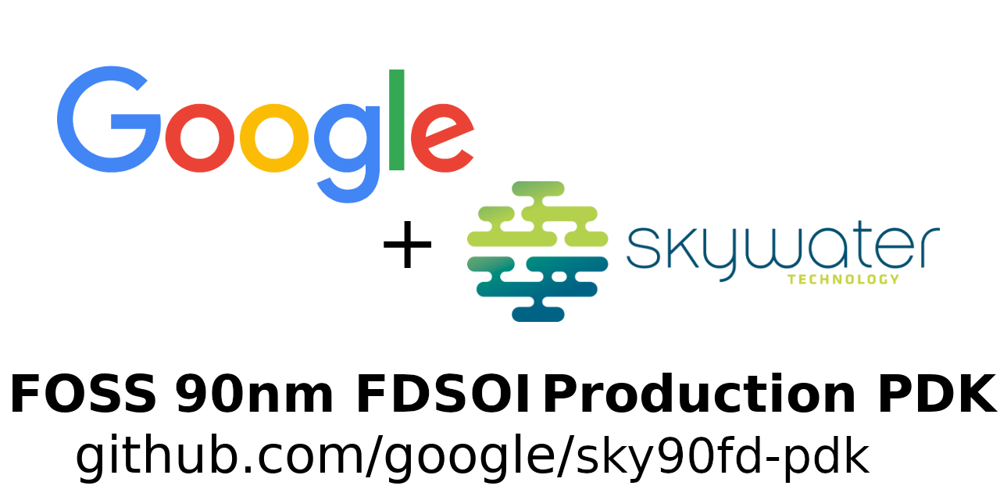

SkyWater SKY90FD Open Source PDK
================================

.. image:: https://img.shields.io/github/license/google/sky90fd-pdk
   :alt: GitHub license - Apache 2.0
   :target: https://github.com/google/sky90fd-pdk

.. image:: https://readthedocs.org/projects/sky90fd-pdk/badge/?version=latest&style=flat
   :alt: ReadTheDocs Badge - https://sky90fd-pdk.rtfd.io
   :target: https://sky90fd-pdk.rtfd.io

.. image:: https://img.shields.io/github/v/tag/google/sky90fd-pdk?include_prereleases&sort=semver
   :alt: Latest GitHub tag (including pre-releases)
   :target: https://gitHub.com/google/sky90fd-pdk/commit/

.. image:: https://img.shields.io/github/commits-since/google/sky90fd-pdk/v0.0.0
   :alt: GitHub commits since latest release (v0.0.0)
   :target: https://gitHub.com/google/sky90fd-pdk/commit/

The SKY90FD Open Source PDK is a collaboration between Google and SkyWater Technology Foundry to provide a fully open source `Process Design Kit <https://en.wikipedia.org/wiki/Process_design_kit>`_ and related resources, which can be used to create manufacturable designs at SkyWater’s facility on their new 90nm FDSOI process technology.

The SKY90FD Open Source PDK documentation can be found at <https://sky90fd-pdk.rtfd.io>.

.. |current-status| replace:: **Experimental Preview**

Current Status -- |current-status|
==================================

.. current_status_text

*Warning*
   Google and SkyWater are currently treating the current content as an **experimental preview** / **alpha release**.

Google, SkyWater and our partners are currently doing internal validation and test designs, including silicon validation or the released data and plan to publish these results.

The PDK will be tagged with a production version when ready to do production design, see the "`Versioning Information <docs/versioning.rst>`_" section for a full description of the version numbering scheme.

To get notified about future new releases of the PDK, and other important news, please sign up on the
`sky90fd-pdk-announce mailing list <https://groups.google.com/forum/#!forum/sky90fd-pdk-announce>`_
[`join link <https://groups.google.com/forum/#!forum/sky90fd-pdk-announce/join>`_].

See both the `Known Issues <docs/known_issues.rst>`_ section and the `SKY90FD PDK GitHub issue list <https://github.com/google/sky90fd-pdk/issues>`_ to get more detailed information around currently known issues.

Resources
=========

The latest design resources can be viewed at the following locations:

* `On Github @ google/sky90fd-pdk <https://github.com/google/sky90fd-pdk>`_
* `Google CodeSearch interface @ https://cs.opensource.google/sky90fd-pdk <https://cs.opensource.google/sky90fd-pdk>`_
* `foss-eda-tools.googlesource.com/sky90fd-pdk <https://foss-eda-tools.googlesource.com/sky90fd-pdk/>`_

SKY90FD Process Node
====================

The SKY90-FD is a 90nm FDSOI process. Unlike a traditional CMOS BULK process, SKY90-FD features a thin layer of insulator material between the substrate and the upper silicon layer. This thin oxide process allows the transistor to be significantly thinner than in the BULK process, allowing the device to be “fully depleted,” and simplifying the fabrication process. This extra insulation greatly reduces parasitic current leakage and lowers junction capacitances, providing improved speed and power performance under various environmental conditions.

The SKY90FD Process node technology stack consists of;

* 5 layers of copper interconnect
* 2 layers of aluminum interconnect

If your needs extend beyond the standard included functionality in the `SKY90FD Process Node`_, please see `Contacting SkyWater`_ as they specializes in enabling production volume of process customization include `the addition of specialized materials like Nb, Ge, V2O5, Carbon Nanotubes <https://www.skywatertechnology.com/technology/>`_. Google and SkyWater continuing to explore new options to be included in the `SKY90FD Open Source PDK`_ and `SKY90FD Process Node`_ that enable new innovative solutions to traditional design problems.

Typical usages of 90nm Process Nodes
-------------------------------------

Prerequisites
=============

At a minimum:

-  Git 2.35+
-  Python 3.6+

On Ubuntu, simply
------------------

``apt install -y build-essential virtualenv python3``

Building the documentation
==========================

To build documentation locally, you could use the following commands:

.. code:: bash

   # Download the repository
   git clone https://github.com/google/sky90fd-pdk.git
   cd sky90fd-pdk/docs

   # Create a Python virtual environment and install requirements into it.
   virtualenv env --python=python3
   . env/bin/activate
   pip install -r requirements.txt

   # Build the documentation
   make html

Support
=======

Like many open source projects there are multiple ways to get support on the SKY90FD PDK.

SkyWater has created a Market Partner Ecosystem to be able to provide support from design through back end package and test.  If you are interested in getting additional support through the ASIC development process, reach out to SkyWater using the information in the `Contacting SkyWater`_ section below.

There is also a `users mailing list  <https://groups.google.com/forum/#!forum/sky90fd-pdk-users>`_ [`join link <https://groups.google.com/forum/#!forum/sky90fd-pdk-users/join>`_] to allow like minded users of the PDK to provide support to each other.

Google does not provide external support for using the SkyWater Open Source PDK and is distributing this repository on an "AS IS" BASIS, WITHOUT WARRANTIES OR CONDITIONS OF ANY KIND, either express or implied. See the license_ section for the full terms.

About SkyWater Technology Foundry
=================================

SkyWater is a solely U.S.-based and U.S.-owned, DoD-accredited, Trusted Foundry. Through its Technology Foundry model, SkyWater provides custom design and development services, design IP, and volume manufacturing for integrated circuits and micro devices. The Company’s world-class operations and unique processing capabilities enable mixed-signal CMOS, power, rad-hard and ROIC solutions. SkyWater’s Innovation Engineering Services empower development of superconducting and 3D ICs, along with carbon nanotube, photonic and MEMS devices. SkyWater serves customers in growing markets such as aerospace & defense, automotive, cloud & computing, consumer, industrial, IoT and medical. For more information, please visit: www.skywatertechnology.com/.

SkyWater is building from a long heritage in the microelectronics industry. The SkyWater facility was originally established by Minnesota based Control Data Corporation (CDC) in the 1980s. The CDC fab was acquired by Cypress Semiconductor in 1991. During the Cypress era, the facility was expanded and upgraded multiple times, keeping pace with Moore's Law into the late 2000s and was known for being a US-based production facility that was competitive with Asian-based fabs. SkyWater spun-off from Cypress in 2017 with private equity backing from Minnesota based Oxbow Industries.

Contacting SkyWater
-------------------
Requests for more information about SKY130 and other standard and customer foundry technologies can be emailed to <swfoundry@skywatertechnology.com> or `submitted via this webform <https://www.skywatertechnology.com/contact/>`_.

License
=======

The SKY90FD Open Source PDK is released under the `Apache 2.0 license <https://github.com/google/sky90fd-pdk/blob/master/LICENSE>`_.

The copyright details (which should also be found at the top of every file) are;

::

   Copyright 2022 SkyWater PDK Authors

   Licensed under the Apache License, Version 2.0 (the "License");
   you may not use this file except in compliance with the License.
   You may obtain a copy of the License at

       http://www.apache.org/licenses/LICENSE-2.0

   Unless required by applicable law or agreed to in writing, software
   distributed under the License is distributed on an "AS IS" BASIS,
   WITHOUT WARRANTIES OR CONDITIONS OF ANY KIND, either express or implied.
   See the License for the specific language governing permissions and
   limitations under the License.

